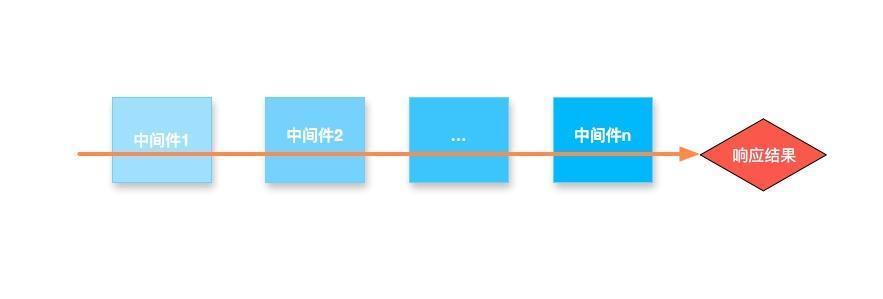
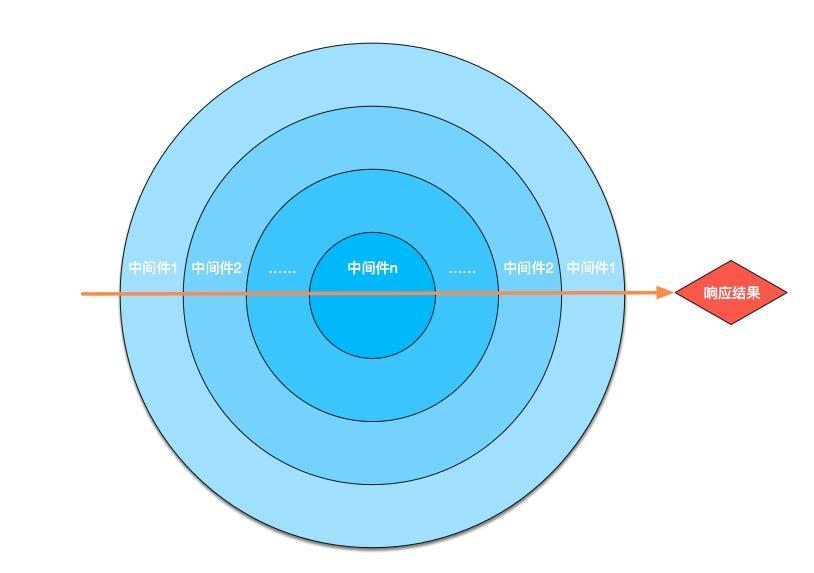

## 中间件执行顺序
Koa 的中间件执行顺序有点特别，与 Express 不同。
Koa 的工作流程并不是从上往下的。Koa 利用了 `generator/async`，打破了以往的顺序流动的代码流程。在下面的代码里，实际上它是一个圆形流程。

`Express` 使用的是顺序流程，从第一个中间件执行到最后一个中间件，发出响应，就像：



`Koa` 是从第一个中间件开始执行，遇到 next 进入下一个中间件，一直执行到最后一个中间件，在逆序，执行上一个中间件 next 之后的代码，一直到第一个中间件执行结束才发出响应。



## 示例

> 下面的例子在页面中返回 "Hello World"，然而当请求开始时，请求先经过 x-response-time 和 logging 中间件，并记录中间件执行起始时间。 然后将控制权交给 reponse 中间件。当中间件运行到 yield next 时，函数挂起并将控制前交给下一个中间件。当没有中间件执行 yield next 时，程序栈会逆序唤起被挂起的中间件来执行接下来的代码。


```js
const Koa = require('koa');
const app = new Koa();

// x-response-time
app.use(async (ctx, next) => {
    // (1) 进入路由
    let start = new Date;
    // 跳到下一个 app.use，也就是 logger
    await next();
    // (5) 再次进入 x-response-time 中间件，记录 2 次通过此中间件「穿越」的时间
    let ms = new Date - start;
    ctx.set('X-Response-Time', ms + 'ms');
    // (6) 结束, 返回 ctx.body，http 响应结束 <-------------
});

// logger
app.use(async (ctx, next) => {
    // (2) 进入 logger 中间件
    let start = new Date;
    // 跳到下一个 app.use，也就是 response
    await next();
    // (4) 再次进入 logger 中间件，记录 2 次通过此中间件「穿越」的时间
    let ms = new Date - start;
    console.log('%s %s - %s ms', ctx.method, ctx.url, ms);
});

// response
app.use(async (ctx, next) => {
    // (3) 进入 response 中间件，没有捕获到下一个符合条件的中间件，传递到 upstream
    ctx.body = 'Hello World';
    // 后面已经没有 app.use，开始 -- 折返运动 ↑↑↑ --
});

app.listen(3333);
```


