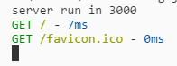

## 自定义中间件
在 Koa2 里开发中间件基本和 Express 差不多。
注意：`async, await`（Nodejs V7.6+） 中间件只能在 koa2 中使用，不能在 Koa1 中使用，同时推荐拥抱 Koa2。

> Express 开发中间件

```js
const colors = require('colors');
module.exports = () => (req, res, next) => {
    console.log('我是中间件'.green);
    next();
}
```

> Koa2 开发中间件

```js
const colors = require('colors');
module.exports = () => async (ctx, next) => {
    console.log('我是中间件'.green);
    await next();
}
```

## 自定义日志信息中间件
下面就自定义一个**日志信息中间件**：

```js
const colors = require('colors'); // 输出颜色

module.exports = () => async (ctx, next) => {
    const start = Date.now();
    await next();
    const end = Date.now();
    // log
    console.log(
        `${ctx.method}`.green,
        `${ctx.url}`.yellow,
        `-`,
        `${end - start}ms`.blue
    );
}
```

使用：

```js
const Koa = require('koa');
const log = require('./log');
const app = new Koa();

app.use(log());

app.use(async ctx => {
    ctx.body = '哈哈哈哈';
});

app.listen(3000, () => {
    console.log('server run in 3000');
});
```

当访问 `http://127.0.0.1:3000/`的时候：


