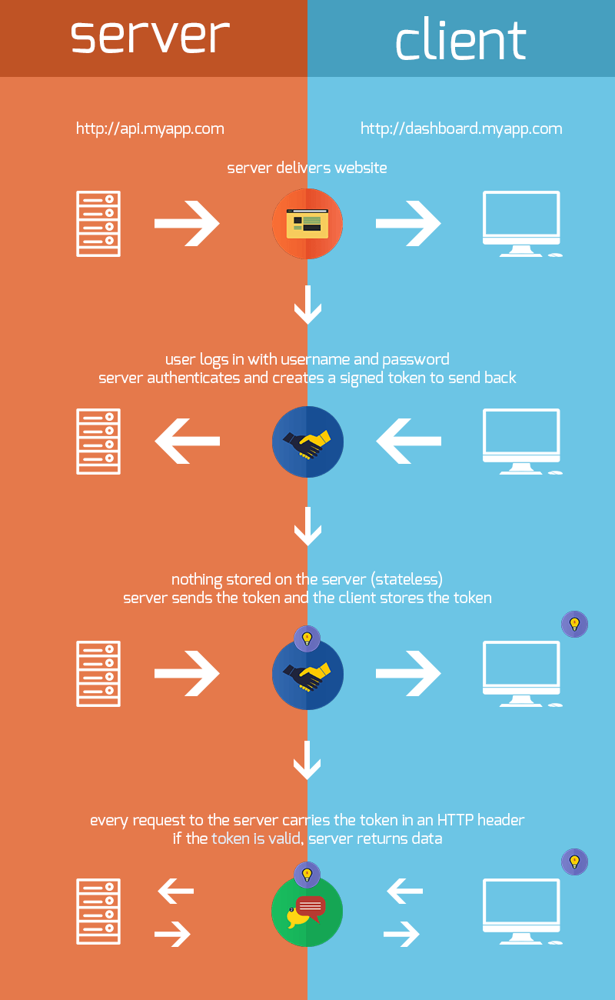

## token
传统的 Web 应用使用 cookie + session 的方式维护整个会话的状态，而现在出来了更新的会话管理方式：`Token`。

比起传统的身份验证方法，Token 扩展性更强，也更安全点，非常适合用在 Web 应用或者移动应用上。Token 的中文有人翻译成 “令牌”，我觉得挺好，意思就是，你拿着这个令牌，才能过一些关卡。

## 验证方式
基于 Token 的身份验证方法，主要有几步：

- 客户端使用用户名跟密码请求登录。
- 服务端收到请求，去验证用户名与密码。
- 验证成功后，服务端会签发一个 Token，再把这个 Token 发送给客户端。
- 客户端收到 Token 以后可以把它存储起来，比如放在 Cookie 里或者 Local Storage 里。
- 客户端每次向服务端请求资源的时候需要带着服务端签发的 Token。
- 服务端收到请求，然后去验证客户端请求里面带着的 Token，如果验证成功，就向客户端返回请求的数据。
- 当客户端退出/会话超时时，就会通知服务器把 Token 销毁。


1. 后端接收到客户端发送的用户名和密码后，验证用户名和密码是否正确。如果错误，则返回错误信息。如果 后端验证正确，生成一个随机的不重复的`token`字符串（例如：aldas2312jdjas12312sjad）。`token`字符串作为用户的唯一标识，在`Mongodb/Redis`里建立`token`字符串与用户名信息（id）对应关系。

2. 后端把`token`字符串和用户信息返回给客户端，客户端保存这些数据到本地缓存里，作为以后身份验证的必备数据。

3. 需要验证用户身份的操作必须要把`token`字符串传给 后端验证身份。（例如：`test.com/update` 这个 API，应该写为`test.com/update?tokenaldas2312jdjas12312sjad=` 或者把`token`写进 http header 里，自定义一个属性名。

4. 后端接收到这个 API 请求时，权限设置要求验证用户身份，于是取出参数中的`token`，去查找`token`与用户信息的关系，最后返相关数据。

5. 当用户退出时，通过调用退出登录的 API，让后端把这个用户对应的`token`字符串删除（从数据库里删除）。



## URL 签名
身份验证是依赖于`token`字符串的，如果用户泄露了自己的 URL，那很大程度上`token`也被别人泄漏了。因此不在网络上传输`token`就能在很大程度防止`token`泄漏，不在网络上传输`token`的方案为 URL 签名。

1. 在第一次登录的时候，客户端拿到`token`之后，在本地进行数据缓存。在之后的 API 请求并不需要带上`token`，而上带上`sign`。

    比如：

    ```js
    sign = md5('test.com/user/info?token=ajdkasjda23123jkh3k21') => eiqowem3m12kkhhisdDSJDd2131das
    ```

    于是， API 请求变成这样：

    ```js
    test.com/user/info?id=5&sign=eiqowem3m12kkhhisdDSJDd2131das
    ```
    **这样就不需要附在 URL 上**

## Nodejs 实现 Token 生成与验证

**Token 生成：**

```js
const crypto = require('crypto');
const SALT = "Don't eat today";

function createToken(id, salt = SALT) {
    return crypto.createHash('md5').update(id + salt).digest('hex');
}
```

**Token 验证：**

```js
async function checkToken(redis, token) {
    const userid = await redis.hget('user', token);
    // 存在 token
    if (userid !== null) {
        // 做点其他事情 --->
        return true;
    }
    return false;
}
```

## Nodejs 实现 URL 签名生成与验证

**URL 签名生成：**

```js
function createSign(url, token, salt = SALT) {
    return crypto.createHash('md5').update(url + token + salt).digest('hex');
}
```

**URL 签名验证：**

```js
async function checkSgin(redis, id, url, sign, salt = SALT) {
    // id 为 key, token 为 value
    const token = await redis.hget('user', id);
    // 验证
    if (token && sign === createSign(url, token)) {
        // 做点其他事情 --->
        return true;
    }
    return false;
}
```

