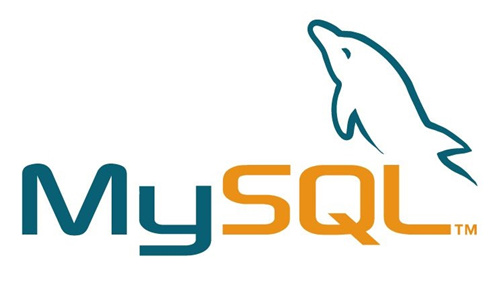

## db-mysql
MySQL是一个关系型数据库管理系统，由瑞典MySQL AB 公司开发，目前属于 Oracle 旗下产品。MySQL 是最流行的关系型数据库管理系统之一。
MySQL是一种关系数据库管理系统，关系数据库将数据保存在不同的表中，而不是将所有数据放在一个大仓库内，这样就增加了速度并提高了灵活性。

在 Nodejs 上连接 MySQL 使用到了一个官方模块 db-mysql。



**安装：**

```bash
npm install --save db-mysql
```


## 连接 MySQL
连接 MySQL 使用到的一些`db-mysql`提供的接口。

配置连接`MySQL`的信息：

```js
const db = new mysql.Database({
    'hostname': '127.0.0.1',     // mysql 连接地址
    'user'    : 'dev',           // 用户名
    'password': '123456',        // 密码
    'database': 'test',          // 数据库名
});

db.connect((err) => {
    if(err) return console.dir(err);
    console.log('你已经连接了数据库');
});
```

## MySQL 查询
`db-mysql`提供原生的 SQL 语句进行查询，也提供了类似 MongoDB 的查询接口。


### SQL 查询
下面示例，使用 SQL 进行查询。其中 `?` 代表的是占位符的意思。

```js
// 创建表
db.query(''
    + 'Create Table Student(                    '
    + '     id smallint not null primary key,   '
    + '     name varchar(20) not null,          '
    + '     age tinyint not null,               '
    + '     sex char(4) not null                '
    + ') Engine=Innodb Default Charset=utf8;    ',
    function(error, packet) {
        if(error) throw error;
        // 创建表成功
        console.log('1. 创建表成功');
    }
);

// 插入
db.query(
    'Insert into Student Values(?, ?, ?, ?)',
    [1, '小东', 20, '男'], // 自动会防 sql 注入处理
    function(error, packet) {
        if(error) throw error;
        // 插入成功
        console.log('2. 插入数据成功');
    }
);

// 查询
db.query(
    'Select * From Student Where id = ' + number,
    // 字符串拼接不会防 sql 注入处理
    function(error, rows) {
        if(error) throw error;
        // 处理查询结果 rows is Array
        console.log('3. 查询成功')
        console.log(JSON.stringify(rows, null, 4));
    }
);

// 更新
db.query(
    'Update Student Set name = ? Where id = ?',
    ['小明', 1],
    function(error, packet) {
        if(error) throw error;
        // 更新成功
        console.log('4. 更新成功');
    }
);

// 删除
db.query(
    'Delete From Student Where id = ?',
    [1],
    function(error, packet) {
        if(error) throw error;
        // 删除成功
        console.log('5. 删除成功');
    }
);

// 创建存储过程
db.query(''
    + 'Create Procedure getStudentAllName() '
    + 'Begin                                '
    + '     Select s.name From Student As s;'
    + 'End                                  ',
    function(error, packet) {
        if(error) throw error;
        // 存储过程创建成功
        console.log('6. 存储过程创建成功');
    }
);

// 调用存储过程
db.query(
    'Call getStudentAllName()',
    function(error, rows) {
        if(error) throw error;
        // 存储过程输出的内容
        console.log('7. 存储过程调用成功');
    }
);
```

**上面查询输出的结果：**

```js
[nodemon] starting `node server.js`
1. 创建表成功
2. 插入数据成功
3. 查询成功
[
    {
        "id": 1,
        "name": "小东",
        "age": 20,
        "sex": "男"
    }
]
4. 更新成功
5. 删除成功
6. 存储过程创建成功
7. 存储过程调用成功
```

**pakcet 参数返回的信息，主要是操作了SQL语句后的一些信息：**

```js
OkPacket {
    fieldCount: 0,
    affectedRows: 0,
    insertId: 0,
    serverStatus: 2,
    warningCount: 0,
    message: '',
    protocol41: true,
    changedRows: 0
}
```

### db-mysql API 查询
`db-mysql` API 为我们做好了字符串转义，所以不用担心 SQL 注入。

```js
// 查询
db.query().select(['id', 'user_login']).from('user')
    .where('user_login = ? And user_password = ?', ['abcde', '12345'])
    .execute((err, rows, columus) => {
        if(err) return console.dir(err);
        console.dir(rows);
    });

// 插入
db.query().insert('user',
    ['user_login', 'user_password'], ['newbie', '123456']
).execute((err, row, columus) => {
        if(err) return console.dir(err);
        console.dir(rows);
    });

// 更新
db.query().update('user').set({
        'user_name': 'new name',
        'user_age': 'new age',
    })
    .where('user_login = ?', ['newbie'])
    .execute((err, rows, columus) => {
        if(err) return console.dir(err);
        console.dir(rows);
    });

// 删除
db.query().delete().from('user')
    .where('user_login = ?', ['newbie'])
    .execute((err, rows, columus) => {
        if(err) return console.dir(err);
        console.dir(rows);
    });
```

## mysqljs/mysql
除了 db-mysql 外，还有一个 mysqljs/mysql，使用基本差不多。
具体参考：[https://github.com/mysqljs/mysql](https://github.com/mysqljs/mysql)


## 参考资料
> https://www.npmjs.com/package/db-mysql

