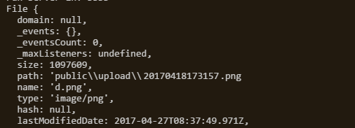

## formidable
`formidables`是一个强大的文件上传解析中间，能够提供包含字段和文件信息的对象。

**安装：**

```js
npm install --save formidable
```

## 用法（Promise）

```js
const fs = require('fs');
const Formidable = require('formidable');
const path = require('path');
const mkdirs = require('mkdirs');

exports.formidables = (ctx, options = {}) => {

    // 配置
    options = Object.assign(options, {
        tempDir: './temp',
        uploadDir: './upload',
        publicDir: './public',
    });

    // 创建目录
    mkdirs(path.join(options.publicDir, options.tempDir));
    mkdirs(path.join(options.publicDir, options.uploadDir));

    return new Promise((resolve, reject) => {

        // 创建 formidable 对象
        const form = new Formidable.IncomingForm();

        // 文件上传临时文件存放路径
        form.uploadDir = path.join(options.publicDir, options.tempDir);

        // 解析文件
        form.parse(ctx.req, (error, fields, files) => {
            // 根据 name 的名称, <input name="myfile" type="file" />
            const file = files.myfile;

            // 设置新的文件名
            const name = Date.now() + '_' + path.basename(file.name);

            // 限制上传文件类型
            const docType = ['image/jpeg', 'image/png', 'image/gif'];

            // 文件类型不是合法的
            if (docType.indexOf(file.type) == -1) {
                // 手动触发 error
                form.emit('error', "不允许的类型");

                // 删掉临时文件
                fs.unlink(file.path, err => err && console.warn(err));

                // 返回文件上传失败
                resolve({ success: false, file: null });
            }
            else {
                // 移动文件到指定目录，并返回信息
                fs.rename(file.path, path.join(options.publicDir, options.uploadDir, name),
                    err => err && console.warn(err) ||
                        resolve({ success: true, file: path.join(options.uploadDir, name) })
                );
            }
        });

        form.on('error', err => {
            reject(err);
        });

        form.on('end', _ => {
            // 上传完成后，处理的工作，比如跳转到其他页面
        });
    });
};
```



**使用：**

```js
const { formidables } = require('./upload');

router.post('/file-upload', async ctx => {
    ctx.body = await formidables (ctx);;
});
```

## 参考资料
- https://github.com/felixge/node-formidable