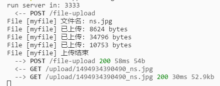
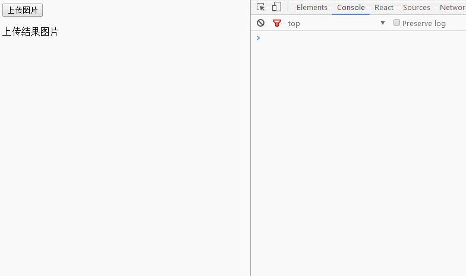
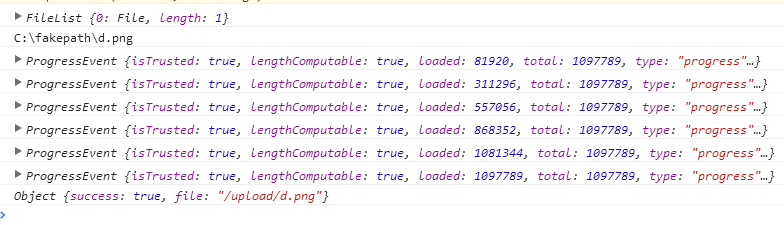

## 文件上传
文件上传是一个非常烦人的功能，在 HTML5 还没出现之间，基本都只能使用同步方式或者 Flash 来实现异步上传。
而 HTML5 新增了一个 FormData 对象，支持异步的文件上传功能。

## 同步方式
使用同步方式很简单，只是设置 `<form>` 即可，下面是 HTML5 的同步文件上传。

```html
<form
    method="POST"
    action="/upload"
    enctype="multipart/form-data"
    accept="image/png,image/gif"
    >

    <input name="myfile" type="file" id="file" />
    <button type="submit" id="submit">submit</button>
</form>
```

**其中：**
- method: 为上传的方法，不能为 get, 可以为 post, put
- action: 为上传的后端地址，提交后会被转跳到目标地址
- enctype: enctype 必须设置为`multipart/form-data`，后端才能识别这是文件上传
- accept: 限制上传文件的格式，应用在选择框的里，同时也需要在后端检测文件类型，进行双保险限制

这样，点击提交后，页面就会把`FormData`数据传递到后端里，同时会转跳页面。



## 异步方式
异步方式，使用的是`Ajax`或`Fetch`，通过创建`FormData`对象来提交数据。
Ajax 框架，推荐使用 `axios`，一个基于`Promise`对原生 Ajax 封装的异步请求框架。

下面使用 `React + Fetch` 来实现，异步上传文件。

```js
import React, { Component } from 'react';
import fetch from 'isomorphic-fetch';

export default class App extends Component {

    state = {
        image: '',
    }

    submit = event => {
        // 创建一个 FormData 对象, H5 API
        const formData = new FormData();

        const input = document.createElement('input');
        input.setAttribute('type', 'file');
        input.setAttribute('name', 'myfile');
        input.click();

        // 监听文件改变事件
        input.onchange = event => {
            formData.append('myfile', input.files[0]);

            console.log(input.files);
            console.log(event.target.value);

            const host = 'http://127.0.0.1:3333';
            // 异步网络请求
            fetch(`${host}/file-upload`, {
                method: 'post',
                body: formData,
            })
                .then(res => res.json())
                .then(json => {
                    console.log(json);

                    this.setState({
                        image: `${host}/${json.file}`
                    });
                });
        }
    };

    render() {
        return (
            <div>
                <button id="go" onClick={this.submit}>上传图片</button>
                <p>上传结果图片</p>
                <div id="view" >
                    
                </div>
            </div>
        );
    }
}
```



## Axios 实现显示上传进度
Fetch 并不支持监听上传进度这样的事件，而原生的 Ajax 支持。
下面使用 `Axios` 来制作上传进度的显示。

```js
// 把 fetch 改成 axios
axios.post(`${host}/file-upload`, formData, {
    onUploadProgress: progressEvent => {
        console.log(progressEvent);
    }
})
    .then(res => res.data)
    .then(json => {
        console.log(json);

        this.setState({
            image: `${host}${json.file}`
        });
    });
```



**得出计算进度的公式：**

```js
onUploadProgress: progressEvent => {
    console.log(progressEvent);

    this.setState({
        loaded: progressEvent.loaded,
        total: progressEvent.total,
        progress: progressEvent.loaded / progressEvent.total,
    });
}
```

## Jquery 实现显示上传进度
Jquery 里需要获取原生的 XHR 对象，然后为`onprogress`添加对应的回调函数即可。

```js
$.ajax({
    type: 'post',
    url: `${host}/file-upload`,
    data: formData,
    processData: false,
    contentType: false,
    xhr: function() {
        const xhr = $.ajaxSettings.xhr();

        xhr.upload && (xhr.upload.onprogress = ProgressEvent => {
            console.log(ProgressEvent);
        })

        return xhr.bind(this);
    },
})
    .promise()
    .done(json => {
        console.log(json);

        this.setState({
            image: `${host}${json.file}`
        });
    })
    .fail(err => {
        console.log(err);
    });
```

## 参考资料
> Fetch: https://github.com/github/fetch#file-upload
> Axios: https://github.com/mzabriskie/axios#request-config

