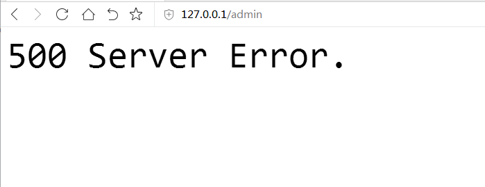

## 400 与 500 错误处理
在 Koa 中`status`的状态码，默认是 404，如果`status`在整个 Request/Response 周期没有发生变化，那么就意味这个 Request 就是 404。

在处理 404/500 的情况，只需要自己写一个简单的中间件即可，把中间件放在`koa-router`前面使用。

```js
const notfound = () => async (ctx, next) => {
    try {
        await next();
    }
    catch (err) {
        ctx.body = '<font size="10">500 Server Error.</font>';
        ctx.status = 500;
    }

    if (ctx.status === 404) {
        ctx.body = '<font size="10">404 Not Found.</font>';
        ctx.status = 404;
    }
};

app
    .use(logger())
    .use(views('./views'))
    .use(notfound())              // 放在 router 前
    .use(router.routes())
    .use(router.allowedMethods())
    ;
```

## 测试
要测试写的代码是否正确，404 只需要访问不存在的路由即可，而 500 需要在应用里抛出一个异常即可。

```js
router
    .get('/admin', async (ctx, next) => {
        if(ctx.req.connection.remoteAddress !== '127.0.0.1') {
            throw new Error('没有访问权限');
            return;
        }
        // some ...
    });
```

