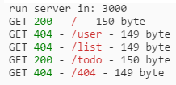

## 自定义路由中间件

下面通过，自定义路由中间件，来简单的展示 Koa2 开发中间件。

> 目录结构


```js
├── index.js
├── render.js
├── route.js
├── package.json
└── view
    ├── 404.html
    ├── index.html
    └── todo.html
```

> render.js | 用来读取 view 中的 html 文件

```js
/**
 * 用 Promise 封装异步读取文件方法
 * @param  {string} page html文件名称
 * @return {promise}
 */
const fs = require('fs');

module.exports = function (page) {
    return new Promise((resolve, reject) => {
        const viewUrl = `./view/${page}`;

        fs.readFile(viewUrl, "binary", (err, data) => {
            return err ? reject(err) : resolve(data);
        });
    })
}
```

> route.js | 自定义的路由中间件

```js
/**
 * 自定义的路由
 * @param  {Object} ctx
 * @return {Function} next
 */
const render = require('./render');
const colors = require('colors');

module.exports = async function route(ctx, next) {
    const url = ctx.request.url;
    let view = '404.html';

    switch (url) {
        case '/':
            view = 'index.html';
            break;
        case '/index':
            view = 'index.html';
            break;
        case '/todo':
            view = 'todo.html';
            break;
        case '/404':
            view = '404.html';
            ctx.status = 404;
            break;
        default:
            ctx.status = 404;
            break;
    }

    ctx.body = await render(view);
    console.log(
        `${ctx.method}`,
        `${(ctx.status + '').green} -`,
        `${ctx.url.red} -`,
        `${ctx.length} byte`
    );
}
```

> index.js | 主文件

```js
const Koa = require('koa2');
const app = new Koa();
const route = require('./route');

app.use(route);
app.listen(3000, () => {
    console.log('run server in: 3000');
});
```

> 运行结果



## 总结
上面简单的通过自定义路由来展示， Koa2 编写路的基本模式。