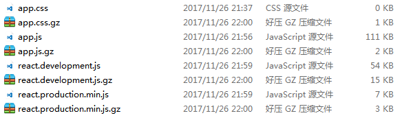

## 静态资源
像 Express 一样，Koa2 需要静态资源的中间件。

一个 http 请求访问 web 服务静态资源，一般会经历三个步骤：

- 访问文本，例如 js，css，png，jpg，gif
- 访问静态目录
- 找不到资源，抛出404错误

<!-- more -->
而在 Express 里最直接的方式是：

```js
app.get('/public/*', (req, res, next) => {
    const url = req.url;
    res.sendFile(req.url);
});
```

而在 Koa2 里一般都是选择第三方中间件：`koa-static`

## koa-static
`koa-static` 是 koa 里的中间件，类似 express-static

**安装：**

```js
npm install --save koa-static
```

**用法：**

```js
const static = require('koa-static');

app.use(static(path.join(__dirname, 'public')));
```

### Gzip
koa-static 是自带 Gzip 功能的，不过它的运作方式是：如果某个静态资源有 .gz 文件，就会读取 .gz 文件，如果没有就会忽视。
我们可以从源码里看到信息：

```js
if (ctx.acceptsEncodings('br', 'identity') === 'br' && brotli && (await fs.exists(path + '.br'))) {
    path = path + '.br'
    ctx.set('Content-Encoding', 'br')
    ctx.res.removeHeader('Content-Length')
    encodingExt = '.br'
}
else if (ctx.acceptsEncodings('gzip', 'identity') === 'gzip' && gzip && (await fs.exists(path + '.gz'))) {
    path = path + '.gz'
    ctx.set('Content-Encoding', 'gzip')
    ctx.res.removeHeader('Content-Length')
    encodingExt = '.gz'
}
```

这意味着，**如果你没有生成 .br 或 .gz 文件，开启了 Gzip 压缩是没有作用了**。

注意到源码里写着 `path + '.gz'`，也就是说，未压缩文件与压缩文件在同级位置。

我们可以自己写一个自动化任务，为每个 js，css 文件生成 .gz 文件。

```js
const zlib = require('zlib');
const fs = require('fs');
const util = require('util');
const path = require('path');

// promisify
const lstat = util.promisify(fs.lstat);
const readdir = util.promisify(fs.readdir);

/**
 * 根据路径生成 Gzip 压缩文件
 */
function Gzip(path) {
    const gzip = zlib.createGzip();
    const inp = fs.createReadStream(path);
    const out = fs.createWriteStream(path + '.gz');
    inp.pipe(gzip).pipe(out);
}

/**
 *  在静态目录里寻找 js 和 css 文件
 * @return{Array} 文件数组
 */
async function findJsOrCss(staticDir, types = ['js', 'css']) {
    let arr = [];
    // 是文件夹
    if ((await lstat(staticDir)).isDirectory()) {
        const files = await readdir(staticDir);
        // 变量文件夹
        for (let file of files) {
            let _path = path.join(staticDir, file);
            let re = new RegExp(`\\.(${types.join('|')})$`);
            // 是文件夹则递归
            if ((await lstat(_path)).isDirectory()) {
                arr = arr.concat(await findJsOrCss(_path, types));
            }
            else if (re.test(_path)) {
                arr.push(_path);
            }
        }
    }

    return arr;
}

// 开始
console.time('run');
findJsOrCss(path.join(__dirname, './build/static'))
    .then(files => files.forEach(f => Gzip(f)))
    .then(res => {
        console.timeEnd('run');
        console.log('全部压缩完成！');
    });
```

压缩效果，Gzip 能节省 70% 左右的文件大小。



## koa-static-cache
`koa-static-cache` 是一个静态资源**缓存**的中间件，与`koa-static`有一定的差别（说实话，看名字就知道有什么差别了）。

与`koa-static`的差别：
- koa-static 不会把数据缓存在内存里，而 koa-static-cache 会把数据缓存在内存里。
- 默认情况下将静态数据存储在内存中，也可以选择存储在磁盘里。
- 在初始化时缓存资源，需要重新启动进程以更新静态资源。
- 使用 MD5 哈希值作为 ETag。
- 如果存在于磁盘上，则使用 .gz 文件，如 nginx gzip_static 模块。

**安装：**

```js
npm install --save koa-static-cache
```

**用法：**

```js
var path = require('path')
var staticCache = require('koa-static-cache')

app.use(staticCache(
    path.join(__dirname, 'public'), {
        maxAge: 365 * 24 * 60 * 60
    }
))
```

## 参考资料

> koa-static: https://github.com/koajs/static


> koa-static-cache: https://github.com/koajs/static-cache

