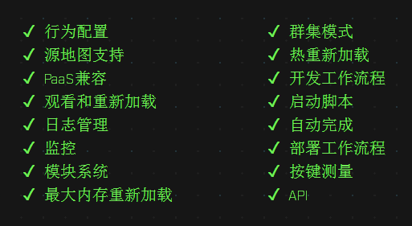

## PM2
PM2 并不是雾霾的意思，而是一个非常优秀的 Nodejs 的进程管理器，下图是 PM2 支持的功能。



因此，可以使用 PM2 来简化很多 Nodejs 应用管理的繁琐任务，如性能监控、自动重启、负载均衡等，而且使用非常简单。

## 基本使用

**安装：**

```bash
npm install -g pm2
```

PM2 安装好后，会自动创建下面目录。（window 上在 User 目录的 `.pm2` 文件夹）

```bash
$HOME/.pm2 will         # 包含所有 PM2 相关文件
$HOME/.pm2/logs         # 将包含所有应用程序日志
$HOME/.pm2/pids         # 将包含所有应用程序的 PID
$HOME/.pm2/pm2.log      # PM2 日志
$HOME/.pm2/pm2.pid      # PM2 PID
$HOME/.pm2/rpc.sock     # 远程命令的 Socket 文件
$HOME/.pm2/pub.sock     # 对于发布事件的 Socket 文件
$HOME/.pm2/conf.js      # PM2 配置文件
```

使用 PM2 非常简单，只需要使用 start 命令即可，使用后它后在后台运行 Nodejs 进程。

```bash
pm2 start ./bin/www --watch
```

当 Nodejs 应用崩溃时，PM2 会自动重启 Nodejs 应用。添加 `--watch` 选项，可以监听 app.js 文件变化来重启 app。

## 常用命令
列出了相关的常用命令：

### 启动

参数说明：

- `--watch`：监听应用目录的变化，一旦发生变化，自动重启。如果要精确监听、不见听的目录，最好通过配置文件。
- `-i --instances`：启用多少个实例，可用于负载均衡。如果 -i 0 或者 -i max，则根据当前机器核数确定实例数目。
- `--ignore-watch`：排除监听的目录/文件，可以是特定的文件名，也可以是正则。比如 `--ignore-watch="test node_modules 'some scripts'"`
- `-n --name`：应用的名称。查看应用信息的时候可以用到。
- `-o --output <path>`：标准输出日志文件的路径。
- `-e --error <path>`：错误输出日志文件的路径。
- `--interpreter <interpreter>`：指定 PM2 应该使用执行程序（bash，Python…）。

```bash
pm2 start app.js --watch -i 2
```

更多参考：http://pm2.keymetrics.io/docs/usage/quick-start/#options

### 相关命令

```bash
# Fork mode
pm2 start app.js --name my-api # 新进程

# Cluster mode
pm2 start app.js -i 0   # 将根据可用 CPU 启动 LB 的最大进程（集群数）
pm2 start app.js -i max # 同上，过时 api

# Listing

pm2 list                # 显示所有进程状态
pm2 jlist               # 在原始的 JSON 中打印进程列表
pm2 prettylist          # 在美化的 JSON 中打印过程清单

pm2 describe 0          # 显示有关某一特定过程的所有信息

pm2 monit               # 监控所有过程

# Logs

pm2 logs [--raw]        # 在流中显示所有进程日志
pm2 flush               # 清空所有日志文件
pm2 reloadLogs          # 刷新所有的日志

# Actions

pm2 stop all            # 停止所有的过程
pm2 restart all         # 重新启动的所有进程

pm2 reload all          # 将 0s 停机更新应用（网络应用）
pm2 gracefulReload all  # 发送退出消息，然后重新加载（用于联网应用程序）

pm2 stop 0              # 停止特定进程 id
pm2 restart 0           # 重新启动特定进程 id

pm2 delete 0            # 删除 id 为 0 的进程
pm2 delete all          # 删除所有进程

# Misc

pm2 reset <process>     # 重置元数据（重新启动时间…）
pm2 updatePM2           # 记忆中的 PM2 更新
pm2 ping                # 确保 PM2 守护程序已经启动

pm2 sendSignal SIGUSR2 my-app # 将系统信号发送到脚本

pm2 start app.js --no-daemon
pm2 start app.js --no-vizion
pm2 start app.js --no-autorestart
```

### 重启

```bash
pm2 restart app.js
```

## 配置文件
除了使用命令外，还可以使用配置文件启动：

- 配置文件里的设置项，跟命令行参数基本是 一一 对应的。
- 可以选择 yaml 或者 json 文件。
- json 格式的配置文件，pm2 当作普通的 js 文件来处理，所以可以在里面添加注释或者编写代码，这对于动态调整配置很有好处。
- 如果启动的时候指定了配置文件，那么命令行参数会被忽略。（个别参数除外，比如 --env）

```js
module.exports = {
    "name"        : "fis-receiver",         // 应用名称
    "script"      : "./bin/www",            // 实际启动脚本
    "cwd"         : "./",                   // 当前工作路径
    "watch": [                              // 监控变化的目录，一旦变化，自动重启
        "bin",
        "routers"
    ],
    "ignore_watch" : [                      // 从监控目录中排除
        "node_modules",
        "logs",
        "public"
    ],
    "watch_options": {
        "followSymlinks": false
    },
    "error_file" : "./logs/app-err.log",    // 错误日志路径
    "out_file"   : "./logs/app-out.log",    // 普通日志路径
    "env": {
        "NODE_ENV": "production"            // 环境参数，当前指定为生产环境
    }
}
```

然后命名为：`ecosystem.config.js`

之后启动它：

```bash
pm2 ecosystem
# or
pm2 start ecosystem.config.js
```

更多的参考： http://pm2.keymetrics.io/docs/usage/application-declaration/


## 环境切换

在实际项目开发中，我们的应用经常需要在多个环境下部署，比如开发环境、测试环境、生产环境等。在不同环境下，有时候配置项会有差异，比如链接的数据库地址不同等。

对于这种场景，PM2 也是可以很好支持的。首先通过在配置文件中通过 `env_xx` 来声明不同环境的配置，然后在启动应用时，通过 `--env` 参数指定运行的环境。

首先，在配置文件中，通过env选项声明多个环境配置。简单说明下：

- env 为默认的环境配置（生产环境），`env_dev、env_test` 则分别是开发、测试环境。可以看到，不同环境下的 `NODE_ENV、REMOTE_ADDR` 字段的值是不同的。
- 在应用中，可以通过 `process.env.REMOTE_ADDR` 等来读取配置中生命的变量。


```json
"env": {
    "NODE_ENV": "production",
    "REMOTE_ADDR": "http://www.example.com/"
},
"env_dev": {
    "NODE_ENV": "development",
    "REMOTE_ADDR": "http://wdev.example.com/"
},
"env_test": {
    "NODE_ENV": "test",
    "REMOTE_ADDR": "http://wtest.example.com/"
}
```

启动指明环境：

```bash
pm2 start app.js --env dev
```

## 传入 Node Args

命令行：

```bash
pm2 start app.js --node-args="--harmony"
```

配置文件：

```json
module.exports = {
    "name" : "oc-server",
    "script" : "app.js",
    "node_args" : "--harmony"
}
```

## 参考资料
> http://pm2.keymetrics.io/docs/usage/quick-start/#options


> http://www.cnblogs.com/chyingp/p/pm2-documentation.html