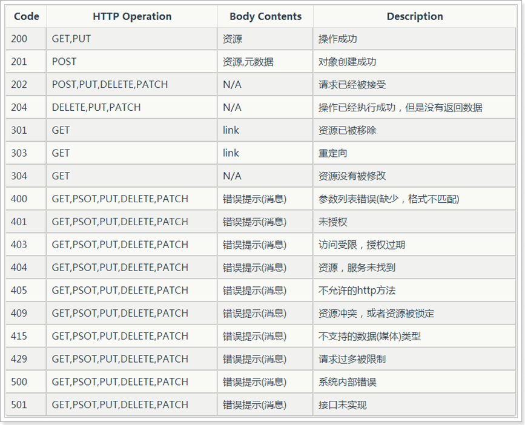

## REST FUL

`RestFul API` 是目前比较成熟的一套互联网应用程序的 API 设计理论。REST 指的是一组架构约束条件和原则。满足这些约束条件和原则的应用程序或设计就是 RESTful。

**RestFul 架构：**
- 每一个 URI 代表一种资源
- 客户端和服务器之间，传递这种资源的某种表现层
- 客户端通过四个 HTTP 动词，对服务器端资源进行操作，实现"表现层状态转化"

**注：**这里概念比较难懂，最好去看 Github 的 RestFul Api 设计，涨涨知识：https://developer.github.com/v3/。

## 区别
先来看看非 REST FUL 风格的 API 与 REST FUL 风格 API 有哪些区别？主要体现在动词的简化，依赖于 HTTP Method 来表达。

```js
非 REST FUL 风格
http://127.0.0.1/user/query/1   GET      根据用户 id 查询用户数据
http://127.0.0.1/user/save      POST     新增用户
http://127.0.0.1/user/update    POST     修改用户信息
http://127.0.0.1/user/delete    GET/POST 删除用户信息

REST FUL 风格
http://127.0.0.1/user/1         GET      根据用户 id 查询用户数据
http://127.0.0.1/user           POST     新增用户
http://127.0.0.1/user           PUT      修改用户信息
http://127.0.0.1/user           DELETE   删除用户信息
```

## 资源

所谓"资源"，就是网络上的一个实体，或者说是网络上的一个具体信息。它可以是一段文本、一张图片、一首歌曲、一种服务，总之就是一个具体的实在。资源总要通过某种载体反应其内容，文本可以用 txt 格式表现，也可以用 HTML 格式、XML 格式表现，甚至可以采用二进制格式；图片可以用 JPG 格式表现，也可以用 PNG 格式表现，JSON 是现在最常用的资源表示格式。

资源是以 json（或其他 Representation）为载体的、面向用户的一组数据集，资源对信息的表达倾向于概念模型中的数据：

- 资源总是以某种 Representation 为载体显示的，即序列化的信息。
- 常用的 Representation 是 json 或者 xml 等。
- Representation 是REST架构的表现层。

## URI

可以用一个 URI（统一资源定位符）指向资源，即每个 URI 都对应一个特定的资源。要获取这个资源，访问它的 URI 就可以，因此 URI 就成了每一个资源的地址或识别符。

一般的，每个资源至少有一个 URI 与之对应，最典型的 `URI` 即 `URL` 。

## 无状态
所谓无状态的，即所有的资源，都可以通过URI定位，而且这个定位与其他资源无关，也不会因为其他资源的变化而改变。


## 认证机制
由于 RESTful 风格的服务是无状态的，认证机制尤为重要。常用的认证机制包括 session auth（即通过用户名密码登录），basic auth，token auth 和 OAuth，服务开发中常用的认证机制为后三者。

- **Basic Auth**
> 简言之，Basic Auth 是配合 RESTful API 使用的最简单的认证方式，只需提供用户名密码，在每次 http 请求时都带上即可，但由于有把用户名密码暴露给第三方客户端的风险，在生产环境下被使用的越来越少。因此，在开发对外开放的 RESTful API 时，尽量避免采用 Basic Auth。

- **Token Auth**
> Token Auth并不常用，它与 Basic Auth 的区别是，不将用户名和密码发送给服务器做用户认证，而是向服务器发送一个事先在服务器端生成的 Token 来做认证。因此 Token Auth 要求服务器端要具备一套完整的 Token 创建和管理机制。

- **OAuth**
> OAuth（开放授权）是一个开放的授权标准，允许用户让第三方应用访问该用户在某一 web 服务上存储的私密的资源（如照片，视频，联系人列表），而无需将用户名和密码提供给第三方应用。
> <br /><br />OAuth 允许用户提供一个令牌，而不是用户名和密码来访问他们存放在特定服务提供者的数据。每一个令牌授权一个特定的第三方系统（例如，视频编辑网站)在特定的时段（例如，接下来的2小时内）内访问特定的资源（例如仅仅是某一相册中的视频）。这样，OAuth 让用户可以授权第三方网站访问他们存储在另外服务提供者的某些特定信息，而非所有内容。
> <br /><br />正是由于 OAUTH 的严谨性和安全性，现在 OAUTH 已成为 RESTful 架构风格中最常用的认证机制，和 RESTful 架构风格一起，成为企业级服务的标配。

## 概念
下面列出一些概念性内容。

**协议**：
API与用户的通信协议，总是使用`HTTP/HTTPS`协议。

**域名**：
应该尽量将 API 部署在专用域名之下。

```js
https://api.example.com
https://example.org/api/
```

**版本**：
应该将 API 的版本号放入 URL。

```js
https://api.example.com/v1/

// 类似的知乎日报 API
https://news-at.zhihu.com/api/4/story/9129166
```

**路径**：
路径又称"终点"（endpoint），表示 API 的具体网址。

在 RESTful 架构中，每个网址代表一种资源（resource），所以网址中不能有动词，只能有名词，而且所用的`名词往往与数据库的表格名对应`。
一般来说，数据库中的表都是同种记录的"集合"（collection），所以API中的名词也应该使用复数。

```js
https://api.example.com/v1/zoos
https://api.example.com/v1/animals
https://api.example.com/v1/employees
```


### HTTP 动词
对于资源的具体操作类型，由 HTTP 动词表示。
常用的 HTTP 动词有下面五个（括号里是对应的 SQL 命令）

method | content
:---| :---
GET（SELECT） 	| 从服务器取出资源（一项或多项）
POST（CREATE） 	| 在服务器新建一个资源
PUT（UPDATE） 	| 在服务器更新资源（客户端提供改变后的完整资源）
PATCH（UPDATE） 	| 在服务器更新资源（客户端提供改变的属性）
DELETE（DELETE）	| 从服务器删除资源

**下面是一些例子：**

mothed | url | content
:--- | :--- | :---
GET  	| `/zoos` 				| 列出所有动物园
POST 	| `/zoos` 				| 新建一个动物园
GET 	| `/zoos/id` 			| 获取某个指定动物园的信息
PUT 	| `/zoos/id` 			| 更新某个指定动物园的信息（提供该动物园的全部信息）
PATCH 	| `/zoos/id` 			| 更新某个指定动物园的信息（提供该动物园的部分信息）
DELETE 	| `/zoos/id` 			| 删除某个动物园
GET 	| `/zoos/id/animals` 	| 列出某个指定动物园的所有动物
DELETE 	| `/zoos/id/animals/id` | 删除某个指定动物园的指定动物

### 过滤信息
如果记录数量很多，服务器不可能都将它们返回给用户。API 应该提供参数，过滤返回结果。
一些常见的参数：

query | content
:--- | :---
`?limit=10` | 指定返回记录的数量
`?offset=10` | 指定返回记录的开始位置。
`?page=2&per_page=100` | 指定第几页，以及每页的记录数。
`?sortby=name&order=asc` | 指定返回结果按照哪个属性排序，以及排序顺序。
`?animal_type_id=1` | 指定筛选条件

### 状态码
服务器向用户返回的状态码和提示信息，常见的有以下一些（方括号中是该状态码对应的 HTTP 动词）



### 错误处理
如果状态码是 4xx，就应该向用户返回出错信息。一般来说，返回的信息中将 error 作为键名，出错信息作为键值即可。

```js
{
    error: "Invalid API key"
}
```

### 返回结果
针对不同操作，服务器向用户返回的结果应该符合以下规范。

code | name | content
:--- | :--- | :---
GET    | `/collection`            |   返回资源对象的列表（数组）
GET    | `/collection/resource`   |   返回单个资源对象
POST   | `/collection`            |   返回新生成的资源对象
PUT    | `/collection/resource`   |   返回完整的资源对象
PATCH  | `/collection/resource`   |   返回完整的资源对象
DELETE | `/collection/resource`   |   返回一个空文档

### Hypermedia API
RESTful API 最好做到 Hypermedia，即返回结果中提供链接，连向其他 API 方法，使得用户不查文档，也知道下一步应该做什么。

```js
{
    "link": {
        "rel":   "collection https://www.example.com/zoos",
        "href":  "https://api.example.com/zoos",
        "title": "List of zoos",
        "type":  "application/vnd.yourformat+json"
    },
    "meta": {
        "limit": 20,
        "offset": 60,
        "total_count": 439
        "next": "/api/v3/trochili/post/?limit=20&post_type=article&offset=80",
        "previous": "/api/v3/trochili/post/?limit=20&post_type=article&offset=40",
    },
}
```

## 参考资料
- https://blog.igevin.info/posts/restful-architecture-in-general/
- http://www.ruanyifeng.com/blog/2014/05/restful_api.html
