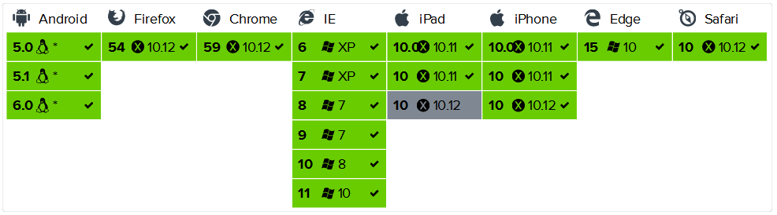

## Socket.io
`Socket.io`是一个非常出名的框架，可能有的人它先是知道了`Socket.io`才了解`Nodejs`。

Socket.io 实现了实时双向的基于事件的通讯机制。旨在让各种浏览器与移动设备上实现实时 App 功能，模糊化各种传输机制。
Socket.io 是跨平台，多种连接方式自动切换，做即时通讯方面的开发很方便，而且能和 Express/Koa 提供的传统请求方式很好的结合，即可以 在同一个域名，同一个端口提供两种连接方式：request/response, websocket(flashsocket,ajax…).

Socket.io 分为`client`与`server`。client 代码根据不同平台而定，而 server 代码会根据不同的后端语言而定，比如 Java、PHP、C#、Nodejs 等。

## Socket.io for Web Client
在前端里使用 Socket.io 非常简单。

下面的相关的文件引入：

```html
<script src="http://cdn.bootcss.com/sockjs-client/1.1.4/sockjs.min.js"></script>
<script>
    const socket = io('http://127.0.0.1:3000');

    socket.on('connect', function() {
        // 连接事件
    });
    socket.on('event', function(data) {
        // 监听自定义事件
    });
    socket.on('disconnect', function() {
        // 断开事件
    });
</script>
```

ES6 模块化：

```js
// npm install --save socket.io-client
import io from 'socket.io-client';
// const io = require('socket.io-client');

const socket = io('http://127.0.0.1:3000');

socket.on('connect', () => {
    // 连接事件
});
socket.on('event', (data) => {
    // 监听自定义事件
});
socket.on('disconnect', () => {
    // 断开事件
});
```

### 基本连接

使用 socket.io 的构造函数来创建连接：`io(url, [options])`

```js
const socket = const socket = io('http://127.0.0.1:3000');
```

默认情况下，在连接到不同的命名空间时使用单个连接（以最小化资源）：

```js
const socket = io();
const adminSocket = io('/admin', { forceNew: true });
// 2 个 socket 连接
```

默认会在 socket 实例创建时自动连接，也可以手动连接/重新连接：

```js
const socket = io({ autoConnect: false });
// 手动连接
socket.open();
socket.on('disconnect', () => {
    //  重新连接
    socket.open();
});
```

### 监听服务器的事件（接收服务器发来的数据）
> socket.on(type, callback);

在前端里，例如：

```js
socket.on("login", (data) => {
    console.log(data); // { user: xiao ming }
});
```

如果在 Nodejs 中使用了触发事件，上面就会收到：

```js
socket.emit("login", {
    user: 'xiao ming',
});
```

### 对服务器触发事件（发送数据到服务器）
> socket.emit(type, data1, [data2, ...]);

例如：

```js
// 触发 Nodejs 中 socket 的 update 事件
socket.emit("update", {
    title: 'Hello',
});
```

此时 Nodejs 中应该有这样一个事件：

```js
socket.on("update", (data) => {
    console.log(data); // { title: Hello }
});
```

### 断开服务器的连接

```js
socket.disconnect();
```

## 兼容性
Socket.io Client 在浏览器的兼容性良好，连 ie6 都支持。实际上在一些底层不支持 WebSocket 机制的浏览器上，Socket.io 会使用 Ajax 轮询的方式。



## 参考资料
- https://socket.io/docs/client-api/
- https://github.com/socketio/socket.io-client
