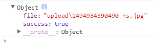

## busboy
`busboy` 是 Nodejs 的一个文件解析中间件，它并不限制于 Koa。
它是通过流的方式进行，文件上传的。

**安装：**

```js
npm install --save busboy
```

## 用法（Promise）
通过 Promise 来封装，正常显示上传成功或失败的信息。

```js
const Busboy = require('busboy');
const inspect = require('util').inspect;
const fs = require('fs');
const path = require('path');
const mkdirs = require('mkdirs');

exports.busboys = (ctx, options = {}) => {

    // 配置
    options = Object.assign(options, {
        uploadDir: './upload',
        publicDir: './public',
    });

    // 创建目录
    mkdirs(path.join(options.publicDir, options.uploadDir));

    return new Promise((resolve, reject) => {
        const busboy = new Busboy({ headers: ctx.req.headers });
        let name = '';

        // 监听文件解析事件
        busboy.on('file', (fieldname, file, filename, encoding, mimetype) => {
            name = Date.now() + '_' + path.basename(filename);

            console.log(`File [${fieldname}] 文件名: ${filename}`);

            // 通过管道的方式，把文件流保存到特定路径
            file.pipe(fs.createWriteStream(
                path.join(options.publicDir, options.uploadDir, name)
            ));

            // 开始解析文件流
            file.on('data', (data) => {
                console.log(`File [${fieldname}] 已上传 ${data.length} bytes`);
            });

            // 解析文件结束
            file.on('end', () => {
                console.log(`File [${fieldname}] 上传结束`);
                resolve({
                    success: true,
                    file: `${path.join(options.uploadDir, name)}`,
                });
            });
        });

        // 监听请求中的字段
        busboy.on('field', function (fieldname, val, fieldnameTruncated, valTruncated) {
            console.log(`Field [${fieldname}]: value: ${inspect(val)}`);
        });

        // 监听结束事件
        busboy.on('finish', function () {
            console.log('Done parsing form!');
            resolve({
                success: true,
                file: `${path.join(options.uploadDir, name)}`,
            });
        });

        // 解析错误事件
        busboy.on('error', function (err) {
            console.log('文件上出错');
            reject({
                success: false,
                file: null,
            });
        });

        // 流
        ctx.req.pipe(busboy);
    });
};
```


**使用：**

```js
const { busboys  } = require('./upload');

router.post('/file-upload', async ctx => {
    ctx.body = await busboys (ctx);
});
```

**上传成功：**




### async
如果，觉得回调太烦人了，可以使用 `async-busboy`，它是 busboy 的 async 封装。

更多参考：https://github.com/m4nuC/async-busboy


## 参考资料
- busboy: https://github.com/mscdex/busboy
