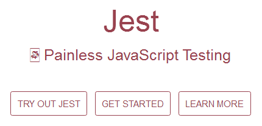
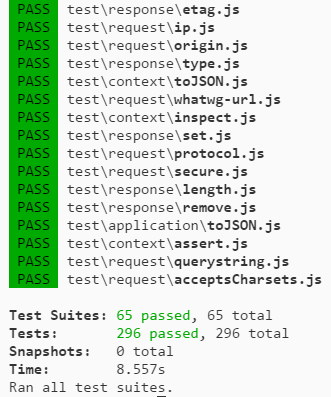
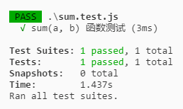
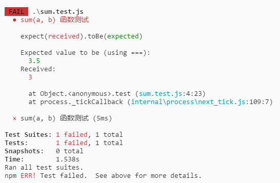
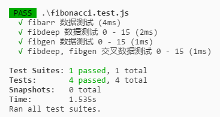
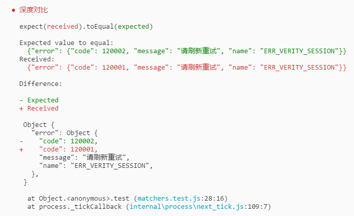

## Jest
`Jest`是`Facebook`的一个专门进行 Javascript 单元测试的工具，之前仅限他们的前端工程师在公司内部使用，后来开源在 Github 上。
它是在 Jasmine 测试框架上演变开发而来，使用了我们熟知的`expect(value).toBe(other)`这种断言格式。

单元测试 (Unit Testing) 是白盒测试的一种，用于针对程序模块进行正确性检验的测试工作。
单元 (Unit) 是指最小可测试的部件。在过程化编程中，一个单元就是单个程序、函数、过程等；对于面向对象编程，最小单元就是方法，包括基类、抽象类、或者子类中的方法。



## 体验
在学习 Jest 之前不如先来体验一下它。我们可以通过 Koa 的源码来体验单元测试。
先在 github 上 clone Koa 下来：

```bash
git clone https://github.com/koajs/koa.git
```

clone 之后，先安装模块，再运行：

```bash
npm install
npm run test
```

运行之后，你会看到这样一个输出，没错这就是单元测试的输出内容。



在 koa 源码里也有很多例子，也可以参考它来学习。


## 开始
下面记录着如何从零开始使用 Jest。

**安装**

```js
npm install jest --save-dev
```

**使用**

> 新建一个 sum.js 文件


```js
module.exports = (a, b) => a + b;
```

> 新建一个 sum.test.js 文件 [注意，名称需要是： xxx.test.js]

```js
const sum = require('./sum');

test('sum(a, b) 函数测试', () => {
    expect(sum(1, 2)).toBe(3);
    expect(sum(1, 6)).toBe(7);
    expect(sum(1, 4)).toBe(3.5);  // 到这里会终止测试
    expect(sum(2, 4)).toBe(6);
});
```

> 在 npm 里添加 test: jest，并运行


```js
npm test
```

***通过测试：***



***不通过测试：***



## 说明

- `test`是一个单元测试函数，第一个参数为：测试项的名称，第二个参数为：测试内容所在的作用域。
- `expect` 是一个接收要测试函数的值，并返回一个`expectation`对象
- `boBe` 是希望要测试函数的值等于多少，用的是 `===`

## 来点更复杂的
上面的示例太过于简单，体验不了单元测试的重要性。
假如，需要编写一个，符合 `a(x) = a(x - 1) + a(x - 2)` 的 fibonacci 函数（斐波那契数列）

### 1. 最简单的方法 - for

```js
const fibarr = n => {
    let fibonacci = [0, 1];

    for (let i = 2; i <= n; i++) {
        fibonacci[i] = fibonacci[i - 1] + fibonacci[i - 2];
    }

    return fibonacci[n];
}
```

### 2. 比较复杂的方法 - 递归

```js
const fibdeep = n => {

    const fibonacci = n => {
        if (n === 0 || n === 1) return n;
        return fibonacci(n - 1) + fibonacci(n - 2);
    }

    return fibonacci(n);
}
```

### 3. 奇妙的方法 - generator

```js
const fibgen = n => {

    function* fibonacci() {
        let fib = [0, 1];
        yield fib[0];
        yield fib[1];

        while (true) {
            fib = [fib[1], fib[0] + fib[1]];
            yield fib[1];
        }
    }

    const gen = fibonacci();
    new Array(n).fill(' ').map(i => gen.next());
    return gen.next().value;
}
```

### 测试
很明显，第一个方法是从直观上是正确的，那么将以第一个方法作为一些测试数据。

基本数据测试，测试`fibarr`：

```js
const { fibarr, fibdeep, fibgen } = require('./fibonacci');
const testdata = [0, 1, 1, 2, 3, 5, 8, 13, 21];

test('fibarr 数据测试', () => {
    for (let i in testdata) {
        expect(fibarr(i)).toBe(testdata[i]);
    }
});

// PASS 通过
```

根据`fibarr`来测试，其他函数：

```js
test('fibdeep 数据测试 0 - 15', () => {
    for (let i = 0; i < 15; i++) {
        expect(fibdeep(i)).toBe(fibarr(i));
    }
});

test('fibgen 数据测试 0 - 15', () => {
    for (let i = 0; i < 15; i++) {
        expect(fibgen(i)).toBe(fibarr(i));
    }
});

test('fibdeep, fibgen 交叉数据测试 0 - 15', () => {
    for (let i = 0; i < 15; i++) {
        expect(fibgen(i)).toBe(fibdeep(i));
    }
});
```

***最后查看测试结果：***




## 模块
可以使用`describe`来声明模块区域：

```js
describe('这是一个模块区域', () => {
    test('这个区域的第一个 test', () => {
        // ...
    });

    test('这个区域的第二个 test', () => {
        // ...
    });
});
```


## Matchers
`Jest`使用匹配器，让您以不同的方式测试值。因为有太多不同的匹配器需要记忆，所以这里只会尝试介绍最有用的。

### toEqual
`toEqual`会对两个对象/数组进行深度的对比，还会分析 diff

```js
test('深度对比', () => {
    const t1 = {
        "error": {
            "message": "请刷新重试",
            "code": 120001,
            "name": "ERR_VERITY_SESSION"
        }
    };

    const t2 = {
        "error": {
            "message": "请刷新重试",
            "code": 120002,
            "name": "ERR_VERITY_SESSION"
        }
    };

    expect(t1).toEqual(t2);
});
```

**测试结果：**




轻易找出了 t1, t2 两个对象的不同地方。

### 真值
在测试中，有时需要进行区分 undefined，null 以及 false，但你有时不想区别对待这些。Jest帮助你，让你明确你想要什么。（记忆起来也是挺困难的）。

```js
test("'false'", () => {
    const z = 'false';
    expect(z).not.toBeNull();       // 不是 null
    expect(z).toBeDefined();        // 是 defined，与 undefined 相反
    expect(z).not.toBeUndefined();  // 不是 undefined
    expect(z).not.toBeTruthy();     // !!后 不是 true
    expect(z).toBeFalsy();          // !!后 是 false
});
```

### 数字

```js
test('two plus two', () => {
    const value = 2 + 2;
    expect(value).toBeGreaterThan(3);           // 大于 3
    expect(value).toBeGreaterThanOrEqual(3.5);  // 大于或等于 3.5
    expect(value).toBeLessThan(5);              // 小于 5
    expect(value).toBeLessThanOrEqual(4.5);     // 小于或等于 4.5

    expect(value).toBe(4);                      // 等于 4
    expect(value).toEqual(4);                   // 等于 4 [深度]
});
```

### 字符串

```js
// 可以使用正则
test('there is no I in team', () => {
    expect('team').not.toMatch(/I/);       // 不包含 i
});

test('but there is a "stop" in Christoph', () => {
    expect('Christoph').toMatch(/stop/);   // 包含 stop
});
```


### 数组
数组的 Api 实在太多了，更多的去查文档。

```js
const shoppingList = [
    'diapers',
    'kleenex',
    'trash bags',
    'paper towels',
    'beer',
];

test('the shopping list has beer on it', () => {
    expect(shoppingList).toContain('beer');   // 包含 beer
});
```


## 异步测试
JavaScript 中常见的代码是异步运行的。
当您有异步运行的代码时，Jest 需要知道它正在测试的代码何时完成，才能进入另一个测试。
Jest 有几种方法来处理这个问题。

### 回调
最常见的异步模式是回调，当使用回调时，要调用参数的 done 函数，不然会无法识别。

```js
test('异步测试', done => {
    function callback(data) {
        expect(data).toBe('peanut butter');
        done();
    }

    fetchData(callback);
});
```

### Promises
只要从你的测试中得到 Promise，Jest 将等待这个 Promise 来 resolve。如果 Promise 被 reject，测试将自动失败。


```js
test('异步测试', () => {
    return fetchData().then(data => {
        expect(data).toBe('peanut butter');
    });
});

// 或者
fetch('https://www.zhihu.com/api/v3/oauth/captcha')
    .then(res => res.json())
    .then(json => {
        console.log(json);

        test('异步测试', () => {
            expect(json).not.toBeUndefined();
        })
    });
```

### Async/Await
最简单的是使用 Async, Await

```js
test('the data is peanut butter', async () => {
    await expect(fetchData()).resolves.toBe('peanut butter');
});
```

## 参考资料
- http://facebook.github.io/jest/docs/zh-Hans/getting-started.html#content
