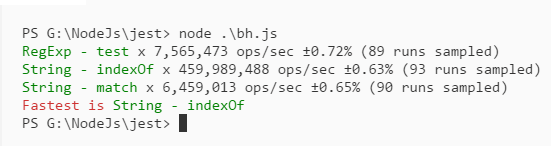
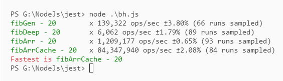
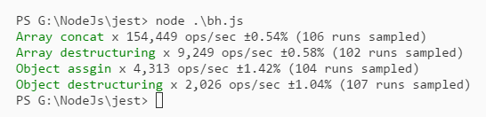
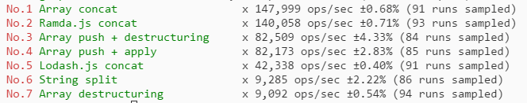

## Benchmark
基准测试是什么，标准的定义是：
`基准测试`（benchmarking）是一种测量和评估软件性能指标的活动。你可以在某个时候通过基准测试建立一个已知的性能水平（称为基准线），当系统的软硬件环境发生变化之后再进行一次基准测试以确定那些变化对性能的影响。这是基准测试最常见的用途。其他用途包括测定某种负载水平下的性能极限、管理系统或环境的变化、发现可能导致性能问题的条件，等等。

<!-- more -->

因此我们可以使用 `benchmark` 做这样的事情：
- 比如，当我们想比较 RegExp 的 `test` 方法和 String 对象的 `indexOf` 方法查找字符串谁的速度更快的话，js 代码在不同的浏览器，不同的操作系统环境运行的效率可能是不一样的，这就是为什么我们需要对其进行基准测试，在做基准测试方面，我们可以使用 Benchmark.js。

## 开始
要使用 benchmark，我们先来安装它：

```bash
# 在 nodejs 上
npm install --save benchmark
# 在浏览器上
<script src="lodash.js"></script>    # 工具相关
<script src="platform.js"></script>  # 平台相关
<script src="benchmark.js"></script> # 基准测试
```

下面是 benchmark 的示例代码：

```js
const Benchmark = require('benchmark');
const colors = require('colors');
const suite = new Benchmark.Suite;

// add tests
suite
    .add('RegExp - test'.green, function () {
        /o/.test('Hello World!');
    })
    .add('String - indexOf'.green, function () {
        'Hello World!'.indexOf('o') > -1;
    })
    .add('String - match'.green, function () {
        !!'Hello World!'.match(/o/);
    })
    .on('cycle', function (event) {
        console.log(String(event.target));
    })
    .on('complete', function () {
        console.log('Fastest is '.red + this.filter('fastest').map('name'));
    })
    .run({ 'async': true });
```

测试的结果是：`indexOf` 最快。

**注意：**在 benchmark 里并不会校验每个测试项的输出是否正确，那么需要确保每个测试项的输出是相同的。



## fibonacci 数列实现的性能
我们通过不同的方法实现了 fibonacci 数列，但是到底哪个是性能最好的呢？这样使用 benchmark 进行基准测试。

准备了以下四种实现方法：

```js
// 使用 "生成器" 来实现
function fibGen(n) {
    function* fibonacci() {
        let fib = [0, 1];
        yield fib[0];
        yield fib[1];

        while (true) {
            fib = [fib[1], fib[0] + fib[1]];
            yield fib[1];
        }
    }

    const gen = fibonacci();
    new Array(n).fill(' ').map(i => gen.next());
    return gen.next().value;
}

// 递归实现
function fibDeep(n) {
    const fibonacci = n => {
        if (n === 0 || n === 1) return n;
        return fibonacci(n - 1) + fibonacci(n - 2);
    }
    return fibonacci(n);
}

// 数组实现
function fibArr(n) {
    let fibonacci = [0, 1];
    for (let i = 2; i <= n; i++) {
        fibonacci[i] = fibonacci[i - 1] + fibonacci[i - 2];
    }
    return fibonacci[n];
}

// 数组实现 + 备忘模式（缓存模式）
function fibArrCache(n) {
    if (fibArrCache.cache[n]) return fibArrCache.cache[n];

    let fibonacci = [0, 1];
    for (let i = 2; i <= n; i++) {
        fibonacci[i] = fibonacci[i - 1] + fibonacci[i - 2];
    }

    fibArrCache.cache[n] = fibonacci[n];
    return fibonacci[n];
}
// 静态方法
fibArrCache.cache = [];
```

开始测试：

```js
suite
    .add('fibGen - 20'.padEnd(18, ' ').green, function () {
        fibGen(20);
    })
    .add('fibDeep - 20'.padEnd(18, ' ').green, function () {
        fibDeep(20);
    })
    .add('fibArr - 20'.padEnd(18, ' ').green, function () {
        fibArr(20);
    })
    .add('fibArrCache - 20'.padEnd(18, ' ').green, function () {
        fibArrCache(20);
    })
    .on('cycle', function (event) {
        console.log(String(event.target));
    })
    .on('complete', function () {
        console.log('Fastest is '.red + this.filter('fastest').map('name'));
    })
    .run({ 'async': true });
```



果然，最快是数组 + 缓存。

## ES6 解构语法
测试 ES6 解构语法性能。

```js
let list1 = [], list2 = [];
let obj1 = {}, obj2 = {};

// 1000
for (let i = 0; i < 1e3; i++) {
    list1.push(Math.random * 1000 | 0);
    list2.push(Math.random * 1000 | 0);
    obj1[i] = Math.random * 1000 | 0;
    obj2[i] = Math.random * 1000 | 0;
}

suite
    .add('Array concat'.green, function () {
        let res = list1.concat(list2);
    })
    .add('Array destructuring'.green, function () {
        let res = [...list1, ...list2];
    })
    .add('Object assgin'.green, function () {
        let res = Object.assign(obj1, obj2);
    })
    .add('Object destructuring'.green, function () {
        let res = { ...obj1, ...obj2 };
    })
```

测试结果：



不测还不知道，ES6 数组解构比 concat 慢这么多，几乎是 20 倍。

## 异步测试
如果要进行异步测试，直接在回调函数里使用 async/await 即可：

```js
.add('fetch', async function () {
    await fetch('http://127.0.0.1');
})
```

## 数组复制
数组复制，最常用的就是 slice(0)，除了 slice 还有 concat，for，甚至是 ...。

```js
suite
    .add('slice', function () {
        let res = data.slice();
    })
    .add('concat', function () {
        let res = data.concat([]);
    })
    .add('for', function () {
        let res = [];
        for (let i = 0, len = data.length; i < len; i++) {
            res[i] = data[i];
        }
    })
    .add('...', function () {
        let res = [...data];
    });
```

基准结果：

```bash
slice x 395,925 ops/sec ±0.91% (87 runs sampled)
concat x 675,662 ops/sec ±4.03% (84 runs sampled)
for x 100,621 ops/sec ±3.68% (82 runs sampled)
... x 18,616 ops/sec ±0.52% (94 runs sampled)
```

## 测试结果排名
默认，只会列出性能最快的测试项，下面是可以列出测试项的排名。
**注意：**下面的代码使用了颜色模块：colors。

```js
.on('complete', function () {
    const tests = Array.from(this); // 把类数组对象转为真正的数组
    tests.sort((a, b) => b.hz - a.hz);
    tests.forEach((item, index) => {
        console.log(`No.${index + 1}`.red, String(item));
    });
})
```



## 配置项
配置项实在太多了，具体看文档，这里列出几个比较重要的配置项。

```js
Benchmark.options.async         // 一个标志，表示基准循环默认执行异步
Benchmark.options.defer         // 表示基准时钟延迟的标志
Benchmark.options.delay         // 测试周期之间的延迟（秒）
Benchmark.options.id            // id
Benchmark.options.initCount     // 在基准测试的第一个周期执行测试的默认次数
Benchmark.options.maxTime       // 在完成之前允许基准测试运行的最长时间（秒，周期延迟不计入最大时间）
Benchmark.options.minSamples    // 执行统计分析所需的最小样本量
Benchmark.options.minTime       // 将测量百分比不确定度降低到 1％（秒）所需的时间
Benchmark.options.name          // 基准的名称
Benchmark.options.onAbort       // 当基准测试中止时调用的事件侦听器
Benchmark.options.onComplete    // 当基准测试完成运行时调用的事件侦听器
Benchmark.options.onCycle       // 每个运行循环后调用的事件侦听器
Benchmark.options.onError       // 一个事件侦听器调用时出现测试错误
Benchmark.options.onReset       // 当基准重置时调用的事件侦听器
Benchmark.options.onStart       // 当基准开始运行时调用的事件侦听器
```

这些选项在哪里设置，当然是在 run 里设置：

> Benchmark.prototype.run([options = {}])

或者是构造函数里：

> Benchmark(name, fn [, options = {}])

## 参考资料
- https://benchmarkjs.com/