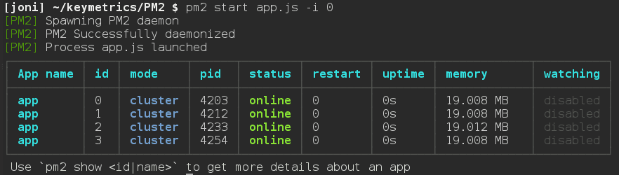
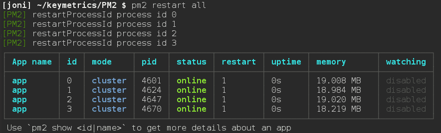

## 集群
`Nodejs`运行在 Chrome 的 JavaScript 运行时平台上，我们把该平台优雅地称之为 `V8 引擎`。
不论是 V8 引擎，还是之后的 Nodejs，都是以***单线程***的方式运行的，因此，在多核心处理器的系统中并不能发挥其最大的性能。

但是，在 Nodejs 推出了 cluster（集群）模块后，最大限度的利用多核 CPU 运行 Nodejs 成为了可能。
<!-- more -->


## Cluster 模块
`Nodejs`给我们提供了 cluster 模块，它可以生成多个工作线程来***共享*** 同一个 TCP 连接。

下面的一个简单 Cluster 代码：

```js
const cluster = require('cluster');
const http = require('http');
const numCPUs = require('os').cpus().length;

// 当该进程是主进程时，返回 True
if (cluster.isMaster) {
    console.log(`主进程 pid:${process.pid} 正在运行`);

    // 衍生工作进程，根据 CPU 个数
    for (let i = 0; i < numCPUs; i++) {
        cluster.fork();
    }

    cluster.on('exit', (worker, code, signal) => {
        console.log(`工作进程 pid:${worker.process.pid} 已退出`);
    });
}
else {
    // 工作进程可以共享任何 TCP 连接。
    // 在本例子中，共享的是一个 HTTP 服务器。
    http.createServer((req, res) => {
        res.writeHead(200);
        res.end('你好世界\n');
    }).listen(8000);

    console.log(`server run in 127.0.0.1:8000`);
    console.log(`工作进程 pid:${process.pid} 已启动`);
}
```

运行起来，那么工作进程就会共享`8000`端口：

```js
$ node server.js

server run in 127.0.0.1:8000
主进程 pid:3596 正在运行
工作进程 pid:4324 已启动
工作进程 pid:4520 已启动
工作进程 pid:5644 已启动
工作进程 pid:6056 已启动
```

当然，你可以指定任意数量的工作线程，线程的数量不仅限于 CPU 核心的数量，因为它只是作为一个运行在 CPU 上的子线程。

正如你所看到的，要使其正常运行，你需要将你的代码封装到 cluster 的处理逻辑中，并添加一些额外的代码来指定当一个线程挂掉之后如何进行处理。

**它是如何运作的呢？**

首先，`Cluster`会创建一个`master`，然后根据你指定的数量复制出多个 server app （也被称之为工作线程）。
它通过`IPC`通道与工作线程之间进行通信，并使用内置的负载均衡来更好地处理线程之间的压力，该负载均衡使用了`Round-robin`算法（也被称之为循环算法）。

> **什么是Round Robin？** <br />
> 轮询调度（Round Robin Scheduling）算法就是以轮询的方式依次将请求调度不同的服务器，即每次调度执行 i = (i + 1) mod n，并选出第i台服务器。算法的优点是其简洁性，它无需记录当前所有连接的状态，所以它是一种无状态调度。<br />
> 轮询调度算法假设所有服务器处理性能均相同，不管服务器的当前连接数和响应速度。该算法相对简单，不适用于服务器组中处理性能不一的情况，而且当请求服务时间变化比较大时，轮询调度算法容易导致服务器间的负载不平衡。<br />
> 所以此种均衡算法适合于服务器组中的所有服务器都有相同的软硬件配置并且平均服务请求相对均衡的情况。

当使用`Round-robin`调度策略时，master accepts() 所有传入的连接请求，然后将相应的`TCP`请求处理发送给选中的工作线程（该方式仍然通过`IPC`来进行通信）。

比如说，当前有 10000 个请求，master 可能会平均分配给每个工作线程去处理，它们对应处理 2500 个请求，而每个工作线程是运行在不同的 CPU（多核 CPU）上的，这样处理性能会大大提升。


## PM2 集群
PM2 内置了 cluster 的处理逻辑，所以我们可以使用 PM2 来配置 Nodejs 集群。

下面是 Koa2 的一个 http 服务：

```js
const Koa = require('koa');
const Router = require('koa-router');

const app = new Koa();
const router = new Router();

router.get('/', async ctx => {
    ctx.body = 'hello world!';
});

app.use(router.routes());
app.listen(3000);
```

然后使用 PM2 来启动集群服务：


```bash
pm2 start app.js -i 4
```

也可以通过 js/json 配置文件来启动：

```json
{
    "apps" : [{
        "script"    : "api.js",
        "instances" : 0,
        "exec_mode" : "cluster"
    }]
}
```

然后启动配置文件：

```bash
pm2 start config.json
```

其中：`-i <number of workers>`参数用来告诉 PM2 以`cluster_mode`的形式运行 app.js，后面的数字表示要启动的工作线程的**数量**。如果给定的数字为 0，PM2  则会根据你 CPU 核心的数量来生成对应的工作线程。



### 保持运行
无论如何，PM2 都会尽可能保持你的 app.js 运行。如果任意一个工作线程挂掉了，不用担心，PM2 会立即将其重启。当然，你也完全可以在任何时候手动重启这些线程（pm2 restart all）。





### 在产品环境实现零停机更新

PM2 的`reload <app name>`功能将依次**重启**所有的工作线程。每一个线程会等待在新的线程创建之后才会被终止掉，因此，当你在产品环境部署新的代码时，server 会不间断地一直保持运行。
使用`gracefulReload`功能可以达到相同的目的，不同的是它不会立即终止工作线程，而是通过 IPC 发送一个 shutdown 信号来关闭所有当前的连接并处理一些自定义的任务，然后再优雅地退出。如下面的代码：

```js
process.on('message', function(msg) {
    if (msg === 'shutdown') {
        close_all_connections();
        delete_cache();
        server.close();
        process.exit(0);
    }
});
```

### 使用配置文件
使用配置文件能够更好的配置 PM2，而不应该是使用一堆的命令。

下面的 Javascript 的配置文件，只需要导入一个配置对象即可。推荐使用这种方式，因为还可以注释，使用 json 就不可以注释。

 **注意：**使用 Javascript 配置文件需要结束文件名`.config.js`

```js
module.exports = {
    apps : [{
        name        : "worker",             // 应用名称
        script      : "./worker.js",        // 入口文件
        watch       : true,
        env: {
            "NODE_ENV": "development",      // 开发模式
        },
        env_production : {
            "NODE_ENV": "production"        // 生成模式
        }
    },{
        name       : "api-app",
        script     : "./api.js",
        instances  : 4,                     // 4 个工作线程
        exec_mode  : "cluster"              // 使用集群模式
    }]
}
```

也可以使用 json，基本和 Javascript object 差不多。

**开始它：**

```bash
pm2 start ecosystem.config.js
```

### 将 PM2 配置成自动启动
想要 PM2 在服务器重启后自动运行之前的应用，可以先通过 pm2 start 启动你的应用，然后执行下面的命令：

```bash
pm2 save
```

这将在`~/.pm2`目录下生成一个 dump.pm2 文件，里面描述了当前 PM2 上运行着的所有应用。然后执行命令：

```bash
pm2 startup [platform]
```

注意有必要添加可选参数 platform 以明确告知 PM2 当前的系统环境。这样，下次当服务器重启时，PM2 会自动运行之前保存的应用。


## 最后
Cluster 模块的功能非常强大，使用 PM2 会使它变得更加容易。在 Node 0.10.x 时代 cluster.js 还只是个试验品，但从 Node 0.11.x 开始已经逐渐成熟并开始准备正式发布，当然也包括 Node 0.12.x 版本。强烈推荐使用最新版的 Nodejs 和 PM2，这些产品的贡献者们一直在努力并使它们变得更好。

## 参考资料
- http://nodejs.cn/api/cluster.html
- https://keymetrics.io/2015/03/26/pm2-clustering-made-easy/
- http://pm2.keymetrics.io/docs/usage/cluster-mode/
