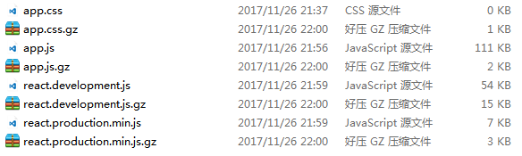

## 静态资源
像 Express 一样，Koa2 需要静态资源的中间件。

一个 http 请求访问 web 服务静态资源，一般会经历三个步骤：

- 访问文本，例如 js，css，png，jpg，gif。
- 访问静态目录。
- 找不到资源，抛出 404 错误。

<!-- more -->
而在 Express 里最直接的方式是：

```js
app.get('/public/*', (req, res, next) => {
    const url = req.url;
    res.sendFile(req.url);
});
```

而在 Koa2 里一般都是选择第三方中间件：`koa-static`

## koa-static
`koa-static` 是 koa 里的中间件，类似 express-static

**安装：**

```js
npm install --save koa-static
```

**用法：**

```js
const serve = require('koa-static');
app.use(serve(path.join(__dirname, 'public')));
```

在 `koa-static` 里并没有提供前缀的选项，而是需要使用 `koa-mount` 实现前缀功能。例如在上面，指定静态目录为 public，当访问 `public/image/a.png` 时固然是 `/image/a.png`。现在为了分一个 static 的路径给静态资源使用，而不是在 public 里创建一个 static 目录，访问的路径变成了：`/static/image/a.png`。

```js
const mount = require('koa-mount');
const serve = require('koa-static');

app.use(mount('/static', serve(path.join(__dirname, 'public'))));
```

### Gzip
koa-static 是自带 Gzip 功能的，不过它的运作方式是：**如果某个静态资源有 .gz 文件，就会读取 .gz 文件，如果没有就会忽视。**
我们可以从源码里看到信息：

```js
// koa-static/index.js
if (ctx.acceptsEncodings('br', 'identity') === 'br' && brotli
    && (await fs.exists(path + '.br'))) {
    path = path + '.br'
    ctx.set('Content-Encoding', 'br')
    ctx.res.removeHeader('Content-Length')
    encodingExt = '.br'
}
else if (ctx.acceptsEncodings('gzip', 'identity') === 'gzip' && gzip
        && (await fs.exists(path + '.gz'))) {
    path = path + '.gz'
    ctx.set('Content-Encoding', 'gzip')
    ctx.res.removeHeader('Content-Length')
    encodingExt = '.gz'
}
```

这意味着，**如果你没有生成 .br 或 .gz 文件，开启了 Gzip 压缩是没有作用了**。

注意到源码里写着 `path + '.gz'`，也就是说，未压缩文件与压缩文件在同级位置。

我们可以自己写一个自动化任务，为每个 js，css 文件生成 .gz 文件。

```js
const zlib = require('zlib');
const fs = require('fs');
const util = require('util');
const path = require('path');
const findFileExt = require('find-file-ext'); // 查找对应后缀的文件

const lstat = util.promisify(fs.lstat);
const readdir = util.promisify(fs.readdir);

/**
 * 根据路径生成 Gzip 压缩文件
 */
function Gzip(path) {
    const gzip = zlib.createGzip();
    const inp = fs.createReadStream(path);
    const out = fs.createWriteStream(path + '.gz');
    inp.pipe(gzip).pipe(out);
}

// 开始
console.time('run');
findFileExt(path.join(__dirname, './build/static'), ['js', 'css'])
    .then(paths => paths.forEach(p => Gzip(p)))
    .then(res => {
        console.timeEnd('run');
        console.log('全部压缩完成！');
    });
```

压缩效果，Gzip 能节省 70% 左右的文件大小。




## 参考资料
- https://github.com/koajs/static
